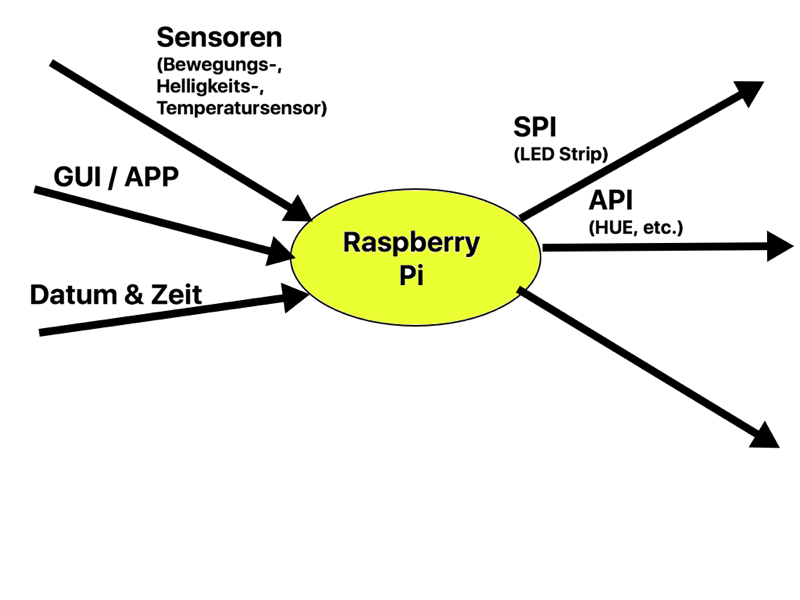

# Analyse

## Problembeschreibung
Viele Menschen starten - gerade in den dunklen Wintermonaten - sehr schlecht in den Tag, weil sie durch einen schrillen Weckton vor Sonnenaufgang geweckt werden oder in einem ungünstigen Schlafrythmus sind. Gerade Menschen mit einem späten Chronotypen fühlen sich dadurch den ganzen Tag schläfrig und können oftmals weniger Leistung bringen. Auch führt dies zu einer ungesunden Überzufuhr vom Wirkstoff Thein. 

Der Markt hat auf diese Problematik mit sogenannten Wake-Up Lights reagiert. Ein Wake-Up Light simuliert einen künstlichen Sonnenaufgang auf die gewünschte Weckzeit hin und verspricht so einen natürlicheren Aufwachvorgang. Die positive Wirksamkeit von Wake-Up Lights wurde auch schon in einer Studie von Giménez [Gim] untersucht und aufgezeigt.

Die existierenden Produkte auf dem Markt sind meist stark eingebunden in ein bestehendes Produktökosystem, was ihre Bedienung vereinfacht, aber meist wenig Erweiterungs- und Anbindungsmöglichkeiten bietet. Beispielsweise erlauben heutige Wake-Up Lights Weckmusik nur in Kombination mit lokalen Musikdateien auf dem Smartphone oder mit Musikdiensten. 

## Vision 
Mit einem Raspberry Pi als Controller und einem LED-Strip wird ein Wake-Up Light konzipiert und gebaut, das über ein GUI konfiguriert werden kann. Der Benutzer kann das Wake-Up Light so einstellen, dass er auf eine bestimmten Zeit hin geweckt wird. Zusätzlich soll das Wake-Up Light mit schwachem Licht einschalten, wenn der Benutzer in der Nacht aufsteht und das Zimmer verlässt. Die Software auf dem Raspberry Pi soll ausserdem in Zukunft noch weitere - allenfalls bereits bestehende - Geräte wie einen Receiver, oder Smart Lights ansprechen, um den Weckvorgang noch weiter auf den Benutzer zuzuschneidern. 

## Anforderungen
1. Das Wake-Up Light dimmt ein Leuchtmittel, so dass es in einer vorgegebenen Zeitperiode von 0 lux auf das maximal Mögliche gedimmt wird. Die von der Zeit abhängige Lichtstärke ist hartcodiert, während der Zeitpunkt bei maximaler Leuchtstärke durch den Benutzer festgelegt wird (Weckzeit). 
2. Das Wake-Up Light reagiert bei Dunkelheit auf Bewegungen, und schaltet das Leuchtmittel im Nachtlichtmodus ein.
3. Das Wake-Up Light schaltet das Leuchtmittel nur ein, wenn es nicht bereits hell in der Umgebung ist.
4. Das Wake-Up Light ist durch Knopfdruck einschaltbar und dient so als eine normale Zimmerbeleuchtung. 

### Use Cases
* Weckfunktion
	1. Weckzeitpunkt - konfigurierte Dimmzeit tritt ein
	1. Wake-Up Light startet Weckprozess (Leuchtmittel Dimm ein)
	1. Benutzer wacht auf und drückt Knopf
	1. Wake-Up Light schaltet aus
* Nachtlichtfunktion
	1. Benutzer steht auf
	1. Wake-Up Light prüft Umgebungslicht
		1. Wake-Up Light schaltet helligkeitsbedingt das Leuchtmittel ein
	1. Wake-Up Light schaltet sich automatisch aus
* Betrieb auf Knopfdruck
	1. Benutzer drückt Knopf
	1. Wake-Up Light schaltet ein
	1. Benutzer drückt Knopf erneut
	1. Wake-Up Light schaltet aus

### Kontextdiagramm

## Zeitplan
### Rahmenbedingungen
* 15.10.2016 : Abgabe Projektidee
* 05.11.2016 : Abgabe Kontextdiagramm, Anforderungsliste, Terminplan
* 19.11.2016 : Abgabe Schaltungsentwurf / Softwareentwurf / Testkonzept
* 03.12.2016 : Präsenz
* 03.01.2017 : Abgabe Dokumentation
* 14.01.2017 : Präsentation

### Grobprojektplan
* 15.10.2016 - 05.11.2016 : Analyse
* 06.11.2016 - 19.11.2016 : Design
* 20.11.2016 - 03.01.2017 : Implementation
* 04.01.2017 - 10.01.2017 : Testing
* 11.01.2017 - 13.01.2017 : Präsentation erstellen

## Quellen
* [Gim] [Effects of artificial dawn on subjective ratings of sleep inertia and dim light melatonin onset.](https://www.ncbi.nlm.nih.gov/pubmed/20653451) 
