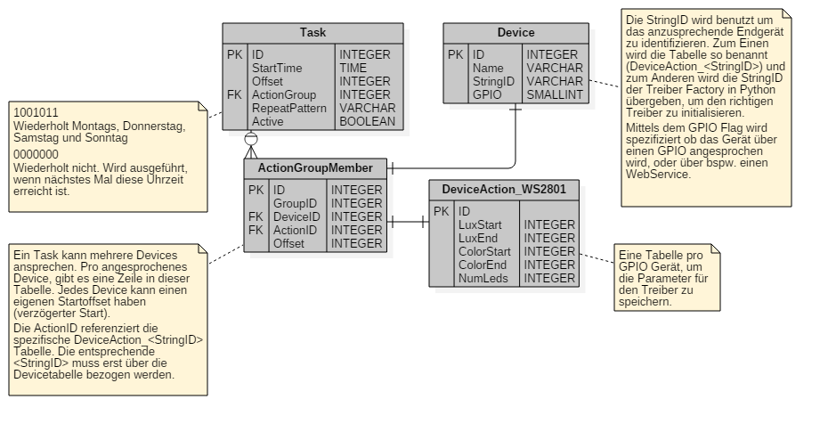
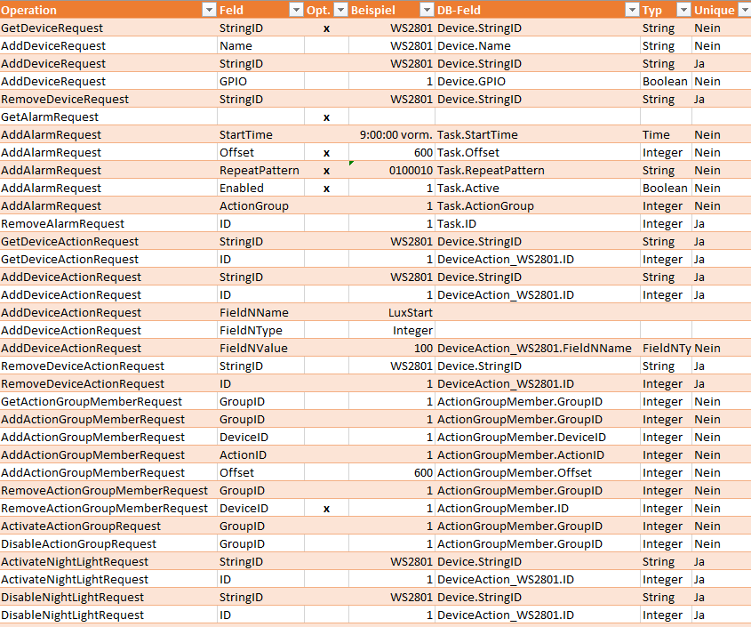
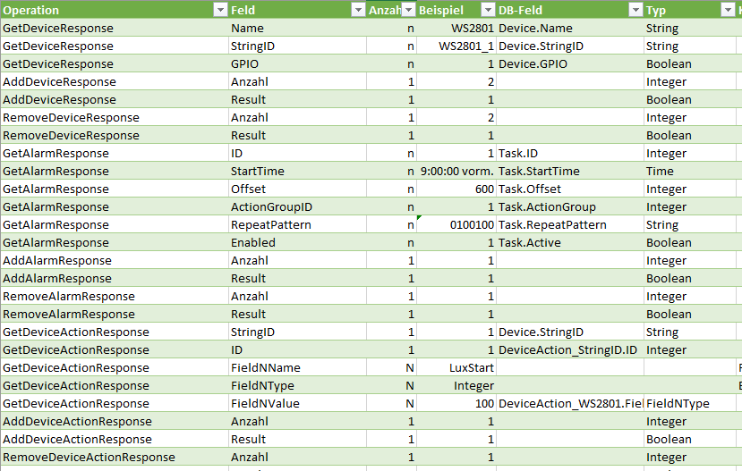
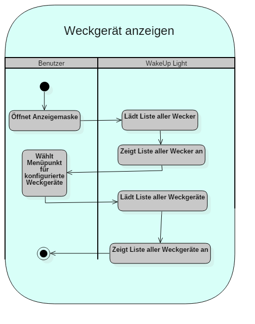
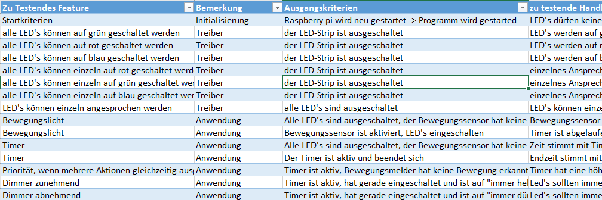

# Designdokument

## Projekt
WakeUp-Light

## Gruppe
* Andreas Züger
* Markus Schenk
* Endre Marczi

## Vorwort
Das nachfolgende Designdokument soll die Anforderungen an das WakeUp-Light, die in der Analyse definiert wurden, in umsetzbare Spezifikationen manifestieren. Dazu werden die bereits gefundenen Use Cases ausgebaut und mit Details angereichert, es werden erste Klassendiagramme eingeführt, das Datenmodell und der WebService spezifiziert und das Schaltbild wird zum ersten Mal präsentiert. 

## Projektmanagement
Um das Projekt WakeUp-Light besser zu koordinieren wurde das Vorhaben in fünf Phasen gegliedert. 
1. Analyse
2. Design
3. Implementierung
4. Test
5. Abgabe und Präsentation

Zu jeder Phase wurden terminierte und beschriebene Work Items erstellt. Jedes Work Item stellt eine unabhängig, abschliessbare Arbeitseinheit ein. Die Projektteilnehmer können sich für Work Items selbstständig eintragen und sind dann dafür verantwortlich, sie bis zum Endtermin abzuliefern. Zurzeit besteht das Projekt aus 49 Work Items die bis zum Abschluss der Phase 3 reichen.  

## Use Case Diagramme
Beim entwerfen der Klassendiagramme wurde auf den bestehenden Use Cases aus der Analysephase aufgebaut. Die Use Cases wurden wo sinnvoll erweitert, umbenannt oder ergänzt um möglichst stimmig für den Endbenutzer und die Entwickler zu sein. 

## Datenmodell
Das Datenmodell stellt die persistente Datenhaltung in der Datenbank dar. Der Treiberlayer zieht Aufträge aus der Datenbank und der Middlewarelayer schreibt Aufträge in die Datenbank und liest Informationen zur Anzeige aus der Datenbank. 

Für jedes anzusprechende Device gibt es einen Eintrag in der Tabelle «Device». Dort wird ein ID-String abgelegt, über den man das Gerät auf allen Schichten eindeutig identifizieren kann. Zu jeder Zeile in «Device» gibt es eine eigene Tabelle «DeviceAction_<ID_STRING>». Dort werden die Parameter des Device abgelegt. Im Falle unseres LED-Strips sind das die Start- und Endhelligkeit, die Start- und Endfarbe sowie die Anzahl der LEDs (bzw. Pixel).
 
In der Tabelle «ActionGroupMember» werden die Geräte zu einer ActionGroup zusammengefasst. Die Tabelle Task ruft also eine ActionGroup auf und in der «ActionGroupMember» Tabelle gibt es für jedes Gerät, dass zu diesem Task etwas ausführen soll, eine Zeile. In jeder Zeile kann ein zusätzlicher Offset angegeben werden, wenn beispielsweise ein Gerät in der ActionGroup erst später anlaufen soll.  

## Definition Web Service
Um zur Steuerung des WakeUp Lights nicht von einem spezifischen Gerätetyp abhängig zu sein, werden die Steuerungsaufträge sowie die Informationsabfragen über Web Service Abfragen getätigt. Dieser Web Service wird hier zum ersten Mal spezifiziert. Die nachfolgenden Klassendiagramme basieren auf dieser Spezifikation. 

Die volle Spezifikation befindet sich in der Projektablage als Excel-Datei. 

### Web Service Operations
* GetDevice
* AddDevice
* RemoveDevice
* GetAlarm
* AddAlarm
* RemoveAlarm
* GetDeviceAction
* AddDeviceAction
* RemoveDeviceAction
* GetActionGroupMember
* AddActionGroupMember
* RemoveActionGroupMember
* ActivateActionGroup
* DisableActionGroup
* ActivateNightLight
* DisableNightLight

### Web Service Requests
Nachfolgend ist eine Übersicht der zu den Operations gehörigen Requests abgebildet. Das Bild ist ein statisches Beispiel. Die Dokumentation wird in der Projektablage in der Excel-Datei nachgeführt. 

### Web Service Responses
Nachfolgend ist eine Übersicht der zu den Operations gehörigen Responses abgebildet. Das Bild ist ein statisches Beispiel. Die Dokumentation wird in der Projektablage in der Excel-Datei nachgeführt. 

## Klassendiagramme
Die nachfolgend gezeigten Klassendiagramme basieren auf dem oben dargestellten Datenmodell sowie der Web Service Spezifikation. 

### Treiberlayer

Das Klassendiagramm sieht einen Linux-Daemon vor, der die Hauptlogik enthält. Dieser erstellt einen DBHandler, der regelmässig alle Aufgaben aus der Datenbank lädt. Der DBHandler selektiert alle Tasks die 
1. Aktiv sind, 
2. Die Uhrzeit erreicht ist, 
3. Das RepeatingPattern erfüllt ist und 
4. Deren Devices in der ActionGroup GPIO relevant sind

und schickt diese an den MainService als «BaseTask» zurück. Jetzt wird ein Task für jedes anzusprechende Device erstellt. Der MainService ruft für jeden so erstellten Task, die TaskFactory mit «specialize» auf. «Specialize» versucht anhand der StringID, das richtige POCO-Objekt zu erstellen (Task_WS2801) und gibt dieses zurück. Dieses Objekt wird nun im MainService in der «taskList» abgespeichert. Für jeden Task in der taskList wird nun die DriverFactory mit der StringID des Tasks aufgerufen. Die DriverFactory versucht das richtige Driver-Objekt zu erstellen («Driver_WS2801») und gibt dieses als BaseDriver Objekt zurück. Der MainService ruft nun auf dem BaseDriver-Objekt mittels Polymorphismus die «execute» Funktion auf. Die Execute-Funktion ist in jedem expliziten Driver «Driver_WS2801» implementiert und enthält den Scriptaufruf mit den Angaben aus dem jeweiligen Task (Task_WS2801) Objekt.

### Middlewarelayer

Der SoapHandler schickt bei Bedarf WebService Requests an Komponenten die per Web Service angebunden sind (LIFX) und empfängt WebService Requests, die für das WakeUp-Light gedacht sind. Er implementiert die oben spezifizierten WebService Operationen. 

Der DBProxy übernimmt die Kommunikation zur Datenbank. Der SoapHandler ist dafür zuständig, dass er seine Requests richtig interpretiert und die richtige Funktion auf dem DBProxy aufruft. 

Der SoapProxy übernimmt die tatsächlichen Verbindungsdetails und Netzwerktechnischen Details. Dieser wird hier nicht weiter ausgeführt, da er für die Funktionsweise  der Endsoftware irrelevant ist. 

## Beispiel Sequenzdiagramm
Das nachfolgende Sequenzdiagramm wurde als Beispiel erstellt.

## Testplan
Die im Design ausgearbeitete Spezifikation beinhaltet bereits einiges an Funktionalität. Um diese Funktionalität testen zu können, wurde ein spezifischer Testplan erstellt, der die in der Analyse und dem Design ausgearbeiteten Features abdecken soll. Der Testplan wird im Projektrepository als Excel-Datei geführt und ist hier nur auszugsweise als Beispiel aufgeführt. 

## Schaltungsentwurf
Die Schaltung zeigt, wie das Hauptweckmedium (die LED-Pixelkette WS2801) an den Raspberry PI angeschlossen wird. Die Applikation sieht vor, dass auch andere Geräte angeschlossen und angesteuert werden können. 

