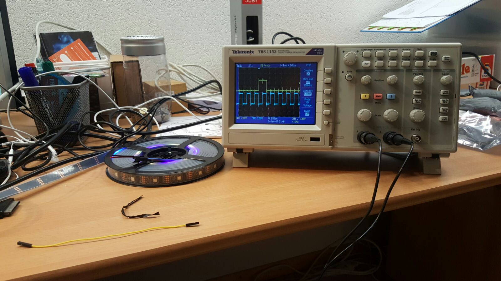

# Projektdokumentation "Wakeup-Light"


## Gruppe
* Andreas Züger
* Markus Schenk
* <del>Endre Marczi</del>

## Abstract
Das Projekt WakeUp-Light erstellt ein Wecksystem dass mittels einem zentralen Server und einem REST-WebService gesteuert werden kann. Der Benutzer des Systems kann Wecker konfigurieren, mit denen er über eine angegebene Weckzeit mit den konfigurierten Weckgeräten geweckt wird. Der zentrale Server stellt die Weckinformationen mittels einem REST-WebService seinen Clients zur Verfügung. Die Clients übernehmen die Ansteuerung der angeschlossenen, externen (Weck-)Geräte und nehmen Input von Sensoren entgegen. Beide Komponenten - der Server und die Clients - sind auf einem oder mehreren Raspberry PI lauffähig.   

## Analyse
### Problembeschreibung
Viele Menschen starten - gerade in den dunklen Wintermonaten - sehr schlecht in den Tag, weil sie durch einen schrillen Weckton vor Sonnenaufgang geweckt werden oder in einem ungünstigen Schlafrythmus sind. Gerade Menschen mit einem späten Chronotypen fühlen sich dadurch den ganzen Tag schläfrig und können oftmals weniger Leistung bringen. Auch führt dies zu einer ungesunden Überzufuhr vom Wirkstoff Thein. 

Der Markt hat auf diese Problematik mit sogenannten Wake-Up Lights reagiert. Ein Wake-Up Light simuliert einen künstlichen Sonnenaufgang auf die gewünschte Weckzeit hin und verspricht so einen natürlicheren Aufwachvorgang. Die positive Wirksamkeit von Wake-Up Lights wurde auch schon in einer Studie von Giménez [Gim] untersucht und aufgezeigt.

Die existierenden Produkte auf dem Markt sind meist stark eingebunden in ein bestehendes Produktökosystem, was ihre Bedienung vereinfacht, aber meist wenig Erweiterungs- und Anbindungsmöglichkeiten bietet. Beispielsweise erlauben heutige Wake-Up Lights Weckmusik nur in Kombination mit lokalen Musikdateien auf dem Smartphone oder mit Musikdiensten. 

### Vision 
Mit einem Raspberry Pi als Controller und einem LED-Strip wird ein Wake-Up Light konzipiert und gebaut, das über ein GUI konfiguriert werden kann. Der Benutzer kann das Wake-Up Light so einstellen, dass er auf eine bestimmten Zeit hin geweckt wird. Zusätzlich soll das Wake-Up Light mit schwachem Licht einschalten, wenn der Benutzer in der Nacht aufsteht und das Zimmer verlässt. Die Software auf dem Raspberry Pi soll ausserdem in Zukunft noch weitere - allenfalls bereits bestehende - Geräte wie einen Receiver, oder Smart Lights ansprechen, um den Weckvorgang noch weiter auf den Benutzer zuzuschneidern. 

### Anforderungen
1. Das Wake-Up Light dimmt ein Leuchtmittel über eine vorgegebene Zeitperiode. 
2. Das Wake-Up Light reagiert bei Dunkelheit auf Bewegungen, und schaltet das Leuchtmittel im Nachtlichtmodus ein.

#### Optional mit Helligkeitssensor
 3. Das Wake-Up Light schaltet das Leuchtmittel nur ein, wenn es nicht bereits hell in der Umgebung ist.
4. Das Wake-Up Light ist durch Knopfdruck einschaltbar und dient so als eine normale Zimmerbeleuchtung. 

### Kontextdiagramm


### Zeitplan
#### Rahmenbedingungen
* 15.10.2016 : Abgabe Projektidee
* 05.11.2016 : Abgabe Kontextdiagramm, Anforderungsliste, Terminplan
* 19.11.2016 : Abgabe Schaltungsentwurf / Softwareentwurf / Testkonzept
* 03.12.2016 : Präsenz
* 03.01.2017 : Abgabe Dokumentation
* 14.01.2017 : Präsentation

#### Grobprojektplan
* 15.10.2016 - 05.11.2016 : Analyse
* 06.11.2016 - 19.11.2016 : Design
* 20.11.2016 - 03.01.2017 : Implementation
* 04.01.2017 - 10.01.2017 : Testing
* 11.01.2017 - 13.01.2017 : Präsentation erstellen* 

## Design

### Vorwort
Das nachfolgende Designdokument soll die Anforderungen an das WakeUp-Light, die in der Analyse definiert wurden, in umsetzbare Spezifikationen manifestieren. Dazu werden die bereits gefundenen Use Cases ausgebaut und mit Details angereichert, es werden erste Klassendiagramme eingeführt, das Datenmodell und der WebService spezifiziert und das Schaltbild wird zum ersten Mal präsentiert. 

### Projektmanagement
Um das Projekt WakeUp-Light besser zu koordinieren wurde das Vorhaben in fünf Phasen gegliedert. 
1. Analyse
2. Design
3. Implementierung
4. Test
5. Abgabe und Präsentation

Zu jeder Phase wurden terminierte und beschriebene Work Items erstellt. Jedes Work Item stellt eine unabhängig, abschliessbare Arbeitseinheit ein. Die Projektteilnehmer können sich für Work Items selbstständig eintragen und sind dann dafür verantwortlich, sie bis zum Endtermin abzuliefern. Zurzeit besteht das Projekt aus 49 Work Items die bis zum Abschluss der Phase 3 reichen.  


### Use Case Diagramme
Beim entwerfen der Klassendiagramme wurde auf den bestehenden Use Cases aus der Analysephase aufgebaut. Die Use Cases wurden wo sinnvoll erweitert, umbenannt oder ergänzt um möglichst stimmig für den Endbenutzer und die Entwickler zu sein. 


### Datenmodell
Das Datenmodell stellt die persistente Datenhaltung in der Datenbank dar. Der Treiberlayer zieht Aufträge aus der Datenbank und der Middlewarelayer schreibt Aufträge in die Datenbank und liest Informationen zur Anzeige aus der Datenbank. 


Für jedes anzusprechende Device gibt es einen Eintrag in der Tabelle «Device». Dort wird ein ID-String abgelegt, über den man das Gerät auf allen Schichten eindeutig identifizieren kann. Zu jeder Zeile in «Device» gibt es eine eigene Tabelle «DeviceAction_<ID_STRING>». Dort werden die Parameter des Device abgelegt. Im Falle unseres LED-Strips sind das die Start- und Endhelligkeit, die Start- und Endfarbe sowie die Anzahl der LEDs (bzw. Pixel).
 
In der Tabelle «ActionGroupMember» werden die Geräte zu einer ActionGroup zusammengefasst. Die Tabelle Task ruft also eine ActionGroup auf und in der «ActionGroupMember» Tabelle gibt es für jedes Gerät, dass zu diesem Task etwas ausführen soll, eine Zeile. In jeder Zeile kann ein zusätzlicher Offset angegeben werden, wenn beispielsweise ein Gerät in der ActionGroup erst später anlaufen soll.  

### Definition Web Service
Um zur Steuerung des WakeUp Lights nicht von einem spezifischen Gerätetyp abhängig zu sein, werden die Steuerungsaufträge sowie die Informationsabfragen über Web Service Abfragen getätigt. Dieser Web Service wird hier zum ersten Mal spezifiziert. Die nachfolgenden Klassendiagramme basieren auf dieser Spezifikation. 

Die volle Spezifikation befindet sich in der Projektablage als Excel-Datei. 

#### Web Service Operations

    GetDevice
    AddDevice
    RemoveDevice
    GetAlarm
    AddAlarm
    RemoveAlarm
    GetDeviceAction
    AddDeviceAction
    RemoveDeviceAction
    GetActionGroupMember
    AddActionGroupMember
    RemoveActionGroupMember
    ActivateActionGroup
    DisableActionGroup
    ActivateNightLight
    DisableNightLight


##### SOAP Requests
Nachfolgend ist eine Übersicht der zu den Operations gehörigen Requests abgebildet. Das Bild ist ein statisches Beispiel. Die Dokumentation wird in der Projektablage in der Excel-Datei nachgeführt. 


##### SOAP Responses
Nachfolgend ist eine Übersicht der zu den Operations gehörigen Responses abgebildet. Das Bild ist ein statisches Beispiel. Die Dokumentation wird in der Projektablage in der Excel-Datei nachgeführt. 


### Klassendiagramme
Die nachfolgend gezeigten Klassendiagramme basieren auf dem oben dargestellten Datenmodell sowie der Web Service Spezifikation. 

#### Treiberlayer


Das Klassendiagramm sieht einen Linux-Daemon vor, der die Hauptlogik enthält. Dieser erstellt einen DBHandler, der regelmässig alle Aufgaben aus der Datenbank lädt. Der DBHandler selektiert alle Tasks die 
1. Aktiv sind, 
2. Die Uhrzeit erreicht ist, 
3. Das RepeatingPattern erfüllt ist und 
4. Deren Devices in der ActionGroup GPIO relevant sind

und schickt diese an den MainService als «BaseTask» zurück. Jetzt wird ein Task für jedes anzusprechende Device erstellt. Der MainService ruft für jeden so erstellten Task, die TaskFactory mit «specialize» auf. «Specialize» versucht anhand der StringID, das richtige POCO-Objekt zu erstellen (Task_WS2801) und gibt dieses zurück. Dieses Objekt wird nun im MainService in der «taskList» abgespeichert. Für jeden Task in der taskList wird nun die DriverFactory mit der StringID des Tasks aufgerufen. Die DriverFactory versucht das richtige Driver-Objekt zu erstellen («Driver_WS2801») und gibt dieses als BaseDriver Objekt zurück. Der MainService ruft nun auf dem BaseDriver-Objekt mittels Polymorphismus die «execute» Funktion auf. Die Execute-Funktion ist in jedem expliziten Driver «Driver_WS2801» implementiert und enthält den Scriptaufruf mit den Angaben aus dem jeweiligen Task (Task_WS2801) Objekt.

#### Middlewarelayer

Der SoapHandler schickt bei Bedarf WebService Requests an Komponenten die per Web Service angebunden sind (LIFX) und empfängt WebService Requests, die für das WakeUp-Light gedacht sind. Er implementiert die oben spezifizierten WebService Operationen. 

Der DBProxy übernimmt die Kommunikation zur Datenbank. Der SoapHandler ist dafür zuständig, dass er seine Requests richtig interpretiert und die richtige Funktion auf dem DBProxy aufruft. 

Der SoapProxy übernimmt die tatsächlichen Verbindungsdetails und Netzwerktechnischen Details. Dieser wird hier nicht weiter ausgeführt, da er für die Funktionsweise  der Endsoftware irrelevant ist. 

### Testplan
Die im Design ausgearbeitete Spezifikation beinhaltet bereits einiges an Funktionalität. Um diese Funktionalität testen zu können, wurde ein spezifischer Testplan erstellt, der die in der Analyse und dem Design ausgearbeiteten Features abdecken soll. Der Testplan wird im Projektrepository als Excel-Datei geführt und ist hier nur auszugsweise als Beispiel aufgeführt. 


### Schaltungsentwurf
Die Schaltung zeigt, wie das Hauptweckmedium (die LED-Pixelkette WS2801) an den Raspberry PI angeschlossen wird. Die Applikation sieht vor, dass auch andere Geräte angeschlossen und angesteuert werden können. 


## Implementation

### Umstellung von SOAP auf REST
Nach dem  Design im Team entschieden den WebService - anstatt wie in der Analyse angedacht mit SOAP - in REST zu implementieren. Dies weil zu diesem Zeitpunkt das Projekt noch ein Teammitglied hatte, das sich nur mit REST WebServices auskannte. Daher wurde die WebService Spezifikation ebenfalls von SOAP auf REST umgeschrieben.  

#### Web Service Operations
* /api/devices
* /api/alarms
* /api/deviceactions
* /api/actiongroupmembers
* /api/actiongroup/activate
* /api/actiongroup/disable
* /api/nightlight/activate
* /api/nightlight/disable

##### GET Operations
Nachfolgend ist eine Übersicht der zu den Operations gehörigen GET-Requests abgebildet. Das Bild ist ein statisches Beispiel. Die Dokumentation wird in der Projektablage in der Excel-Datei nachgeführt. 


##### POST Operations
Nachfolgend ist eine Übersicht der zu den Operations gehörigen POST-Requests abgebildet. Das Bild ist ein statisches Beispiel. Die Dokumentation wird in der Projektablage in der Excel-Datei nachgeführt. 


##### DELETE Operations
Nachfolgend ist eine Übersicht der zu den Operations gehörigen DELETE-Requests abgebildet. Das Bild ist ein statisches Beispiel. Die Dokumentation wird in der Projektablage in der Excel-Datei nachgeführt. 


### Aktualisierte Klassendiagramme

#### Middlewarelayer


**Resources**  
Die Ressourcen sind die Endpunkte des REST Web Service. Für jede ansprechbare Seite, existiert ein Endpunkt. Anfragen an diese Endpunkte verarbeitet die JAX-RS Referenzimplementation Jersey und stellt die jeweiligen Requestparameter mittels Autoboxing den Resource-Klassen zur Verfügung. In diesen Resource-Klassen, sind dann die Java-Methoden implementiert, die das tatsächliche "doing" auf Serverebene ausführen. 

**DBProxyFactory**  
Die DBProxyFactory hat die Aufgabe mittels Dependency Injection eine Referenz auf einen gültigen **IDBProxy** zu produzieren. Die Resource-Klassen greifen über die DBProxyFactory auf die **IDBProxy** Instanz zu und kommunizieren so mit der Datenbank. Dank dieser Indirektion erfüllt die Middleware das Dependency Inversion Principle. 
Die DBProxyFactory ist ein Singleton als Enumeration implementiert. Das hat den Vorteil, dass der Singleton auch nicht mittels Reflection umgangen werden kann, sonst aber gleichwertig zum klassischen Singleton ist. 

**IDBProxy**  
Das IDBProxy Interface implementiert die notwendigen Methoden um mit der Datenbank zu kommunizieren. Eine Klasse, die das  Interface implementiert, muss nur noch Datenbankspezifisch die Methoden implementieren. 

**MySqlDBProxy**  
In der tatsächlichen Implementation wird der SQL-Code umgesetzt, um die im Interface spezifizierten Methoden auszühren. Im Wakeup-Light Projekt, nutzt der finite DBProxy die Apache DbUtils für eine möglichst abstrakte Datenbankkommunikation. 

**Model**  
Die Modelklassen sind die Mappingcontainer für die Verwendung der relationalen Daten aus der Datenbank in der objekt-orientierten Welt. 

#### Treiberlayer Model
  
**Klasse LED**  
Beinhaltet die Grundlogik und Funktionen für jedes LED. Die Werte für Rot, Grün, Blau können einzeln oder zusammen gesetzt werden. Zusätzlich wird als Boolean abgespeichert ob eine neue Farbe gesetzt wurde. Nach jedem abfragen der aktuellen Farbe wird der Boolean wieder auf False gesetzt. So könnten theoretisch nur die LED's mit neuer Farbe aktualisiert werden.

**Klasse LEDObject**  
Diese Klasse erbt von die Grundfunktionen von der Klasse LED und erweitert diese um die zwei Variablen „Priorität“ und „benutzt von“. Idee dahinter ist, dass die Timer unterschiedliche Prioriät haben. So ist bspw. das Nachtlicht sekundär und hat darum eine niedriegere Prio. Ist nun ein Timer aktiv, kann das Nachtlicht ebenfalls reagieren, es ändert aber nichts an der Farben des Strips, da der Timer höherrangig ist.

**Klasse LEDHandler**  
Die Klasse enhält ein Array von LEDObject’s. Somit kann für jeden Aufruf für verschiedene Timer oder andere aktivitäten ein LED mit Farbe, Priorität und ID des Aufrufers abgespeichert werden. Wird nun der Strip „geschrieben“ also physisch angezeigt, wird für jedes einzelne LED die Farbe Aufrufs mit der höchsten Prio angezeigt. Ist z.B. ein Timer beendet, kann mittels der Funktion removeLEDUsedBy() das LED gelöscht werden und das LED mit der nächst tieferen Prio wird angezeigt.

**Klasse LEDStrip**  
LEDStrip bildet den pyhsischen Strip ab. Die Klasse besitzt ein Array mit der Anzahl LEDHandler wie LED’s am Strip sind. Es ist möglich dem ganzen Strip die gleiche Farbe zu geben, sowie auch nur einzelne LED’s zu beeinflussen. Mittels der Funktion setColorToStrip() wird der Strip aktualisiert.


#### Treiberlayer Middlelayer

**Treiber Middlelayer**

Über die API-Klasse werden die Daten der DB Abgefragt. Alle Requests greifen auf die API’s zu. Ursprünglich war vorgesehen, die Daten direkt aus der Datenbank zu beziehen. Dies hätte aber dazu geführt, dass die Weckgeräte stark an die Datenbank gekoppelt gewesen wären - und ein Architekturwechsel in der Datenbank immer Folgen für jedes Weckgerät gehabt hätte. Tests mit dem Web Service haben gezeigt, dass dieser schnell und zuverlässig genug reagiert, dass die Weckgeräte ihre Daten ebenfalls darüber beziehen können. Für jede der einzelnen API’s wurde eine Hilfsklasse erstellt, damit die Daten einfach gespeichert und abgefragt werden können. 
Zusätzlich existiert eine Klasse Alarm. In dieser wird der Alarm abgebildet. 

Das folgende Ablaufdiagramm zeigt, wie der Treiberlayer entscheidet, ob eines seiner angeschlossenen Geräte jetzt aktiviert werden soll. 


### Verwendete Frameworks, Abhängigkeiten und Libraries
Zur Effizienten Umsetzung wurden Libraries und Frameworks eingesetzt. Nachfolgend sind diese externen Abhängigkeiten nach Layer aufgeteilt aufgelistet. 

#### Middleware
* Jersey (JAX-RS Reference Implementation)
* DbUtils (Apache Commons, JDBC Utility Component)
* Tomcat 8 (Applicationserver)
* Java Runtime Environment

#### Treiberlayer
* Python2.7 (mit den Zusatzmodulen requests, xml.dom.minidom, xmltodict um die Api ansprechen zu können)

### Automatisierte Installation
Um die Serverinstallation zu vereinfachen, wurde ein Installationsscript in Shell-Script erstellt, dass die Serverinstallation und das Deployment auf dem Raspberry-PI komplett automatisiert durchführt. 

Das Script initialisiert erst einige Variablen, damit bei Änderungen nicht das ganze Script nicht durchsucht werden muss. 

```bash
#!/bin/bash

mysql_version="mysql-server"
tomcat_version="tomcat8"
java_version="oracle-java8-installer"

context="ROOT"
sqlFile="02_SQL/WI39_Coding.Datenbankscripts.sql"
warFile="03_Middleware/ROOT.war"

JAVA_HOME="/usr/lib/jvm/java-8-oracle"
CATALINA_HOME="/usr/share/$tomcat_version"
CATALINA_BASE="/var/lib/$tomcat_version"
```

Die Funktion canDownload überprüft, ob ein zu installierendes Paket überhaupt verfügbar ist. Die Funktion isInstalled prüft, ob ein entsprechendes Paket nicht bereits installiert ist. 

Damit Software installiert werden kann, muss das Script mit ROOT-Rechten aufgerufen werden. Das Script überprüft, ob der aufrufende User ROOT-Rechte hat, bevor es weitermacht. 

Als ersten Parameter erwartet das Script den Pfad zum Server-WAR-File das deployed werden soll. 

```bash
canDownload()
{
  if [[ $(apt-cache search $1 | wc -l) -gt 0 ]] ; then { return 0; } fi
  return 1
}

isInstalled()
{
  if [[ $(dpkg -l | grep $1 | wc -l) -gt 0 ]] ; then { return 0; } fi
  return 1
}

if [[ "$EUID" -ne 0 ]] ; then
  echo "Please run as root"
  exit
fi

if [ ! -f $1 ] || [ -z ${1+x} ] ; then
  echo "Pass WAR-File as first parameter"; 
  exit 1
fi

warFile=$1
```

Damit die offizielle Oracle JVM installiert werden kann, muss eine zusätzliche Quelle hinzugefügt werden und der entsprechende public key installiert werden. 

```bash
echo "deb http://ppa.launchpad.net/webupd8team/java/ubuntu trusty main" > /etc/apt/sources.list.d/webupd8team-java.list
echo "deb-src http://ppa.launchpad.net/webupd8team/java/ubuntu trusty main" >> /etc/apt/sources.list.d/webupd8team-java.list
apt-key adv --keyserver keyserver.ubuntu.com --recv-keys EEA14886
```

Das Script führt nun einen Quellen Update durch und installiert die debconf-utils damit nachfolgende Konfigurationen der Installationen einfacher durchgeführt werden können. 

```bash
apt-get -y -qq  update
apt-get -y -qq  install debconf-utils
```

Nun werden nacheinander die benötigten Tools installiert. Das Script prüft jeweils erst ob es heruntergeladen werden kann, bevor es tatsächlich etwas versucht zu installieren. Nach der Installation prüft das Script, ob die Installation geklappt hat. Wenn nicht, bricht es ab. 

```bash
if ! canDownload $java_version || ! canDownload $mysql_version || ! canDownload $tomcat_version ; then
  echo "Could not download necessary software. Aborting."
  exit 1
fi

if ! isInstalled $java_version ; then
  echo "installing $java_version..."
  debconf-set-selections <<< "debconf shared/accepted-oracle-license-v1-1 select true"
  debconf-set-selections <<< "debconf shared/accepted-oracle-license-v1-1 seen true"
  apt-get -y -qqq install $java_version > /dev/null

  export JAVA_HOME

  if ! isInstalled $java_version ; then
    echo "Could not install $java_version. Aborting."
    exit 1; 
  fi
fi
```
Tomcat wird als Application Server benutzt, der den REST-WebService hosted. Das Script versucht hier diesen zu installieren und führt einige Basiskonfigurationen durch. 

```bash
if ! isInstalled $tomcat_version ; then
  echo "adding tomcat user..."
  adduser --quiet --system --shell /bin/bash --gecos 'Tomcat Java Servlet and JSP engine' --group --disabled-password --home /home/tomcat $tomcat_version

  echo "installing $tomcat_version..."
  apt-get -y -qq install $tomcat_version > /dev/null

  export CATALINA_HOME
  echo "export CATALINA_BASE=$CATALINA_BASE" >> $CATALINA_HOME/bin/setenv.sh
  chown $tomcat_version:$tomcat_version $CATALINA_HOME/bin/setenv.sh
  chmod a+x $CATALINA_HOME/bin/setenv.sh
  mkdir $CATALINA_BASE/temp
  chown $tomcat_version:$tomcat_version $CATALINA_BASE/temp

  sed -i "s:#JAVA_HOME=.*:JAVA_HOME=$JAVA_HOME:" /etc/default/$tomcat_version

  if ! isInstalled $tomcat_version  ; then
  echo "Could not install $tomcat_version. Aborting."
  exit 1; 
  fi
fi
```
In dieser Präsentationskonfiguration wird MySQL als DBMS eingesetzt. Dieser wird hier installiert.

```bash
if ! isInstalled $mysql_version ; then
  echo "installing $mysql_version..."
  debconf-set-selections <<< "$mysql_version mysql-server/root_password password eshh"
  debconf-set-selections <<< "$mysql_version mysql-server/root_password_again password eshh"
  apt-get -y -qq install $mysql_version > /dev/null

  if ! isInstalled $mysql_version ; then
  echo "Could not install $mysql_version. Aborting."
  exit 1; 
  fi
fi
```

Nun führt das Script eine rudimentäre Konfiguration des MySQL-Server durch und importiert die Testdaten in die Datenbank. Ausserdem wird das mitgegebene WAR-File deployed. 

```bash
ip=$(hostname -I)
echo "[mysqld]"  > /etc/mysql/conf.d/wakeuplight.cnf
echo "bind-address   = $ip" >> /etc/mysql/conf.d/wakeuplight.cnf

echo "adding test data to database mydb..."
mysql --user=root --password=eshh < $sqlFile

rm -rf $CATALINA_BASE/webapps/$context
rm -rf $CATALINA_BASE/webapps/$context.war
cp $warFile $CATALINA_BASE/webapps/$context.war
chown -R $tomcat_version:$tomcat_version $CATALINA_BASE/webapps

systemctl restart $tomcat_version

### Installing Python Tools
echo "install python pip, xmltodict"
sudo apt-get -y -qq install python-pip
sudo pip -q install xmltodict

### summary
echo "All finished!"
echo "MySQL ist available at $ip on port 3306, use the wakeuplight user!"
echo "REST API is available at $ip:8080/rest/"
```
## Tests
Alle Testszenarios wurden durchgespielt. Für die Treibertests wurde ein Skript (testplan.py) angelegt welches die Tests nacheinander durchläuft. Jedes LED lässt sich einzeln steuern. Zusätzlich wurde mit weiteren Tests die Prioritätsfunktion überprüft (wenn mehrere Programme gleichzeitig aktiv sind). Werden für die LED’s verschiedene Prio’s mit verschiedenen Farben festgelegt, erscheinen auch die geforderten Farben. Sobald eine Farbe gelöscht wird, erscheint die Farbe mit der nächst tieferen Prio. Da der Strip als Singleton implementiert wurde, kann man auch sicher sein, dass immer der gleiche Strip angesprochen wird.  


| Testnummer | 1 |
|:-----------------|:---------------------------------------:|
| zu testendes Feature | Startkriterien |
| Bemerkung | Initialisierung |
| Ausgangskriterien | Raspberry pi wird neu gestartet -> Programm wird gestarted |
| zu testende Handlung | LED's dürfen keine undefinierten Werte / Farben haben | 
| erwartete Reaktion | LED's werden korrekt initialisiert und ausgeschaltet | 
| tatsächliche Reaktion | wie erwartet |
| Fazit |  Led's werden zur Sicherheit bei jedem Start der Software neu initalisiert und ausgeschaltet. Funktioniert |

---

| Testnummer | 2 |
|:-----------------|:---------------------------------------:|
| zu testendes Feature | alle LED's können auf grün geschaltet werden  |
| Bemerkung | Treiber |
| Ausgangskriterien | der LED-Strip ist ausgeschaltet |
| zu testende Handlung | Alle LED's werden auf grün geschaltet ( über Konsole ) | 
| erwartete Reaktion | alle LED's leuchten grün | 
| tatsächliche Reaktion | wie erwartet |
| Fazit |  Funktioniert |

---

| Testnummer | 3 |
|:-----------------|:---------------------------------------:|
| zu testendes Feature | alle LED's können auf rot geschaltet werden  |
| Bemerkung | Treiber |
| Ausgangskriterien | der LED-Strip ist ausgeschaltet |
| zu testende Handlung | Alle LED's werden auf rot geschaltet ( über Konsole ) | 
| erwartete Reaktion | alle LED's leuchten rot | 
| tatsächliche Reaktion | wie erwartet |
| Fazit |  Funktioniert |

---

| Testnummer | 4 |
|:-----------------|:---------------------------------------:|
| zu testendes Feature | alle LED's können auf blau geschaltet werden  |
| Bemerkung | Treiber |
| Ausgangskriterien | der LED-Strip ist ausgeschaltet |
| zu testende Handlung | Alle LED's werden auf blau geschaltet ( über Konsole ) | 
| erwartete Reaktion | alle LED's leuchten blau | 
| tatsächliche Reaktion | wie erwartet |
| Fazit |  Funktioniert |

---

| Testnummer | 5 |
|:-----------------|:---------------------------------------:|
| zu testendes Feature | alle LED's können einzeln auf rot geschaltet werden |
| Bemerkung | Treiber |
| Ausgangskriterien | der LED-Strip ist ausgeschaltet |
| zu testende Handlung | einzelnes Ansprechen der LEDs mit rot ( über Konsole / Testscript )  | 
| erwartete Reaktion |jeweils ein nach dem anderen LED leuchtet rot | 
| tatsächliche Reaktion | wie erwartet |
| Fazit |  Das beschreiben des ganzen Strips dauert länger als erwartet, hier sichtbar weil als Test ein "lauflicht" implementiert wurde |

---

| Testnummer | 6 |
|:-----------------|:---------------------------------------:|
| zu testendes Feature | alle LED's können einzeln auf grün geschaltet werden |
| Bemerkung | Treiber |
| Ausgangskriterien | der LED-Strip ist ausgeschaltet |
| zu testende Handlung | einzelnes Ansprechen der LEDs mit grün ( über Konsole / Testscript )  | 
| erwartete Reaktion | jeweils ein nach dem anderen LED leuchtet grün | 
| tatsächliche Reaktion | wie erwartet |
| Fazit | Funktioniert |

---

| Testnummer | 7 |
|:-----------------|:---------------------------------------:|
| zu testendes Feature | alle LED's können einzeln auf blau geschaltet werden |
| Bemerkung | Treiber |
| Ausgangskriterien | der LED-Strip ist ausgeschaltet |
| zu testende Handlung | einzelnes Ansprechen der LEDs mit blau ( über Konsole / Testscript )  | 
| erwartete Reaktion | jeweils ein nach dem anderen LED leuchtet blau | 
| tatsächliche Reaktion | wie erwartet |
| Fazit | Funktioniert |

---

| Testnummer | 8 |
|:-----------------|:---------------------------------------:|
| zu testendes Feature | LED's können einzeln angesprochen werden |
| Bemerkung | Treiber |
| Ausgangskriterien | alle LED's sind ausgeschaltet |
| zu testende Handlung | LED's können einzeln eingeschalten, gedimmt werden (über Konsole / Testscript))  | 
| erwartete Reaktion | Led's können einzeln gesteuert werden | 
| tatsächliche Reaktion | wie erwartet |
| Fazit | je nach Strip können die einzelnen Farben der Led's nicht mit 8 Bit angesteuert werden, sondern nur mit 5 (LPD6803) |

---

| Testnummer | 9 |
|:-----------------|:---------------------------------------:|
| zu testendes Feature | Bewegungslicht |
| Bemerkung | Anwendung |
| Ausgangskriterien | Alle LED's sind ausgeschaltet, der Bewegungssensor hat keine Bewegung erkannt. |
| zu testende Handlung | Bewegungssensor wird aktiviert  | 
| erwartete Reaktion | gewünschte LED schalten ein | 
| tatsächliche Reaktion | wie erwartet |
| Fazit | Funktioniert |

---

| Testnummer | 10 |
|:-----------------|:---------------------------------------:|
| zu testendes Feature | Bewegungslicht |
| Bemerkung | Anwendung |
| Ausgangskriterien | Der Bewegungssensor ist aktiviert, alle LED's sind eingeschalten |
| zu testende Handlung | Timer ist abgelaufen, keine Bewegung vorhanden  | 
| erwartete Reaktion | LED's sollten ausschalten | 
| tatsächliche Reaktion | wie erwartet |
| Fazit | Funktioniert |

---

| Testnummer | 11 |
|:-----------------|:---------------------------------------:|
| zu testendes Feature | Timer |
| Bemerkung | Anwendung |
| Ausgangskriterien | Alle LED's sind ausgeschaltet, der Bewegungssensor hat keine Bewegung erkannt. |
| zu testende Handlung | Zeit stimmt mit Timer überein / richtige Abfolge wird ausgeführt  | 
| erwartete Reaktion | LED's schalten gemäss Timer ein | 
| tatsächliche Reaktion | LED's schalten ein, je nach Prio des Timers kann es aber sein, dass Bereits höherwertige Timer diesen übersteuern. |
| Fazit | Funktioniert |

---

| Testnummer | 12 |
|:-----------------|:---------------------------------------:|
| zu testendes Feature | Timer |
| Bemerkung | Anwendung |
| Ausgangskriterien | Der Timer ist aktiv und beendet sich |
| zu testende Handlung | Endzeit stimmt mit Timer überein, Timer beendet sich  | 
| erwartete Reaktion | LED's schalten ab | 
| tatsächliche Reaktion | wie erwartet |
| Fazit | Timer beendet sich, Strip zeigt andere, tiefer priorisierte LED's an |

---

| Testnummer | 13 |
|:-----------------|:---------------------------------------:|
| zu testendes Feature | Priorität, wenn mehrere Aktionen gleichzeitig ausgeführt werden |
| Bemerkung | Anwendung |
| Ausgangskriterien |Timer ist aktiv, Bewegungsmelder hat keine Bewegung erkannt |
| zu testende Handlung | Timer hat eine höhere Prio als der Bewegungsmelder, die Leds für den Bewegungsmelder, dürfen die anderen nicht überschreiben  | 
| erwartete Reaktion | nichts passiert | 
| tatsächliche Reaktion | wie erwartet |
| Fazit | Strip müsste nicht neu geschrieben werden, da keine Änderungen vorhanden sind. Wird zur Sicherheit den noch neu geschrieben. |


---

| Testnummer | 14 |
|:-----------------|:---------------------------------------:|
| zu testendes Feature | Dimmer zunehmend |
| Bemerkung | Anwendung |
| Ausgangskriterien | Timer ist aktiv, hat gerade eingeschaltet und ist auf "immer heller werden" konfiguriert |
| zu testende Handlung | Led's sollten immer heller werden  | 
| erwartete Reaktion | Led's sollten immer heller werden | 
| tatsächliche Reaktion | wie erwartet |
| Fazit | Zeitintervall zum heller werden ist momentan fix |


---

| Testnummer | 15 |
|:-----------------|:---------------------------------------:|
| zu testendes Feature | Dimmer zunehmend |
| Bemerkung | Anwendung |
| Ausgangskriterien | Timer ist aktiv, hat gerade eingeschaltet und ist auf "immer dünkler werden" konfiguriert |
| zu testende Handlung | Led's sollten immer dünkler werden| 
| erwartete Reaktion | Led's sollten immer dünkler werden | 
| tatsächliche Reaktion | wie erwartet |
| Fazit | Zeitintervall zum heller werden ist momentan fix |



## Fazit
Das Projekt hat sich als sehr softwarelastig entpuppt. Die ursprüngliche Idee, ein Wakeup-Light zu erstellen, hat sich schnell als relativ einfach implementierbar herausgestellt. Komplexität gewann das Projekt durch die Anforderung möglichst erweiterbar zu sein. Dieser Wunsch nach Erweiterbarkeit schlug sich schnell im Softwaredesign nieder und verursache erheblichen Mehraufwand in der Implementation. Die guten libraries für den Raspberry PI haben sehr deutlich gezeigt, dass die Hardware in einem solchen Projekt, nicht das Problem ist, sondern die Software dahinter. 

Obwohl der Hardwareteil etwas kleiner ausgefallen ist, als wir uns ursprünglich vorgestellt haben, sind wir zufrieden mit unserem Resultat. Das Projekt legt eine gute Basis für ein solides und erweiterbares Weck-Automatisierungssystem.

### Projektmanagement
Das Projekt Wakeup-Light wurde - ganz im Geiste des Fernstudiums - komplett "Remote" umgesetzt. So konnten diverse Kollaborations-Tools ausprobiert und direkt in den Projektablauf integriert werden. Ein gutes Beispiel dafür ist der Projektplan, der mittels Google Docs online geteilt wurde. Der Projektplan teilt das ganze Projekt in mehrere Work Items - also kleine, überschaubare Arbeitseinheiten, die von einer einzelnen Person umgesetzt werden können. Diese Work Items wurden dann in Google Docs den Projektteilnehmern zugeteilt und dort auch nachgeführt. Schlussendlich bestand das Projekt Wakeup-light aus über 50 Work Items.  

Der Projektplan ist [hier](https://docs.google.com/spreadsheets/d/1FavRmBRhkSZag9ZJz7cpUHyRiqEvQwWesLXLay4Id8w/edit?usp=sharing) einsehbar. 

### Projektbeteiligung
  
Die Grafik zeigt den Beteiligungsverlauf der Projektteilnehmer. Die grünen Zahlen stellen die hinzugefügten Anzahl Zeilen dar, während die Roten, die gelöschten Zeilen darstellen. Die objektorientierten Analyse & Design Dokumente wurden in einem Format gespeichert, dass die grafischen Elemente textuell beschreibt. So stehen diese Design Dokumente als Textdokumente (JSON) zur Verfügung. Dies hat aber den Nachteil, dass mit der initialen Erstellung dieser Dokumente eine enorm hohe Anzahl an Zeilen (~36'000) erstellt wurden. Dieser Fakt zeigt sich in dieser Endauswertung sehr deutlich.    

### Ausfall Teammitglied
Während des Projekts zeichnete sich sehr schnell ab, das nicht alle Teilnehmer sich gleich stark beteiligen. E.M. hat erst gut gestartet und innerhalb eines Tages das initiale Analysedokument durchgelesen und Korrekturen angebracht. Danach ging es aber leider bergab mit seiner Beteiligung. Die Bitte nach Feedback zu den Designdokumenten blieb bereits unbeantwortet. Auf Rückfrage an der darauffolgenden Präsenz, meinte dieser er habe die Dokumente zwar gesehen, sei dann aber in die Ferien bis nach dem Abgabetermin. Daraufhin wurde vereinbart, dass jeder Projektteilnehmer einen wöchentlichen Status zu seinen Arbeiten abgeben soll. Jeweils auf Rückfrage, schickte E.M. auch einen kurzen Status, die den anderen Projektteilnehmern Hoffnung gab, "dass er einfach kein grosser Redner ist, aber seine Arbeit macht".
Da bereits während der Präsenz durchsickerte, dass E.M. mit der Designentscheidung SOAP als Web Service Architektur zu verwenden, nicht ganz zufrieden war, wurde dies nachträglich zur REST-Architektur geändert, in der Hoffnung, dass dadurch die Beteiligung von E.M. steigen würde. Dieser bedankte sich per E-Mail für diese Änderung und gab an, an der Implementierung eines REST-Clients für den GUI Teil sei. In der darauffolgenden Woche, gab E.M. - wieder erst auf Rückfrage - in seinem Status bekannt, dass er den Client fertig hat und nun am Web-UI bzw. der Schnittstellenimplementierung arbeiten will. Daraufhin wurde er per E-Mail gebeten, seinen aktuellen Arbeitsstand jeweils in das Projekt GIT-Repository hochzuladen - wie es die beiden anderen Projektteilnehmer bereits seit Beginn der Arbeit tun - damit der Stand der Arbeit bewertet werden kann. Ab diesem Zeitpunkt fand keine Kommunikation mehr statt. Die restlichen Projektteilnehmer informierten daraufhin den Dozenten und als dieser E.M. auch nicht erreichen konnte, teilten sie die verbleibenden Arbeiten so gut es ging unter sich auf. 

E.M. war zuständig für die clientseitige Implementation der Applikation. Dazu gehörte der GUI-Teil mit Anbindung an den Web Service. Dieser Teil fehlt nun komplett. Grundsätzlich wäre das Projekt aber bereits anders dimensioniert und aufgeteilt worden, wäre bereits am Anfang klar gewesen, dass das Projekt mit zwei Personen umgesetzt werden muss. 

Sollte es für Notwendig befunden werden, kann auf Nachfrage die ganze E-Mail Kommunikation digital zur Verfügung gestellt werden.  

## Quellen
* [Gim] [Effects of artificial dawn on subjective ratings of sleep inertia and dim light melatonin onset.](https://www.ncbi.nlm.nih.gov/pubmed/20653451) 