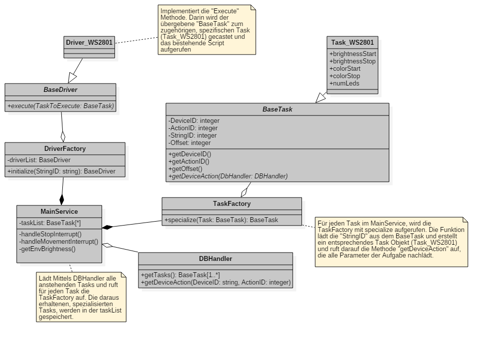

# Projektdokumentation

## Projekt
WakeUp-Light

## Gruppe
* Andreas Züger
* Markus Schenk
* <del>Endre Marczi</del>

## Abstract
Das Projekt WakeUp-Light erstellt ein Wecksystem dass mittels einem zentralen Server und einem REST-WebService gesteuert werden kann. Der Benutzer des Systems kann Wecker konfigurieren, mit denen er über eine angegebene Weckzeit mit den konfigurierten Weckgeräten geweckt wird. Der zentrale Server stellt die Weckinformationen mittels einem REST-WebService seinen Clients zur Verfügung. Die Clients übernehmen die Ansteuerung der angeschlossenen, externen (Weck-)Geräte und nehmen Input von Sensoren entgegen, die ebenfalls über den zentralen WebService zurück gegeben werden können. Beide Komponenten die Clients sind auf einem oder mehreren Raspberry PI lauffähig.   

## Analyse
### Problembeschreibung
Viele Menschen starten - gerade in den dunklen Wintermonaten - sehr schlecht in den Tag, weil sie durch einen schrillen Weckton vor Sonnenaufgang geweckt werden oder in einem ungünstigen Schlafrythmus sind. Gerade Menschen mit einem späten Chronotypen fühlen sich dadurch den ganzen Tag schläfrig und können oftmals weniger Leistung bringen. Auch führt dies zu einer ungesunden Überzufuhr vom Wirkstoff Thein. 

Der Markt hat auf diese Problematik mit sogenannten Wake-Up Lights reagiert. Ein Wake-Up Light simuliert einen künstlichen Sonnenaufgang auf die gewünschte Weckzeit hin und verspricht so einen natürlicheren Aufwachvorgang. Die positive Wirksamkeit von Wake-Up Lights wurde auch schon in einer Studie von Giménez [Gim] untersucht und aufgezeigt.

Die existierenden Produkte auf dem Markt sind meist stark eingebunden in ein bestehendes Produktökosystem, was ihre Bedienung vereinfacht, aber meist wenig Erweiterungs- und Anbindungsmöglichkeiten bietet. Beispielsweise erlauben heutige Wake-Up Lights Weckmusik nur in Kombination mit lokalen Musikdateien auf dem Smartphone oder mit Musikdiensten. 

### Vision 
Mit einem Raspberry Pi als Controller und einem LED-Strip wird ein Wake-Up Light konzipiert und gebaut, das über ein GUI konfiguriert werden kann. Der Benutzer kann das Wake-Up Light so einstellen, dass er auf eine bestimmten Zeit hin geweckt wird. Zusätzlich soll das Wake-Up Light mit schwachem Licht einschalten, wenn der Benutzer in der Nacht aufsteht und das Zimmer verlässt. Die Software auf dem Raspberry Pi soll ausserdem in Zukunft noch weitere - allenfalls bereits bestehende - Geräte wie einen Receiver, oder Smart Lights ansprechen, um den Weckvorgang noch weiter auf den Benutzer zuzuschneidern. 

### Anforderungen
1. Das Wake-Up Light dimmt ein Leuchtmittel über eine vorgegebene Zeitperiode. 
2. Das Wake-Up Light reagiert bei Dunkelheit auf Bewegungen, und schaltet das Leuchtmittel im Nachtlichtmodus ein.
3. Das Wake-Up Light schaltet das Leuchtmittel nur ein, wenn es nicht bereits hell in der Umgebung ist.
4. Das Wake-Up Light ist durch Knopfdruck einschaltbar und dient so als eine normale Zimmerbeleuchtung. 
  
### Kontextdiagramm


### Zeitplan
#### Rahmenbedingungen
* 15.10.2016 : Abgabe Projektidee
* 05.11.2016 : Abgabe Kontextdiagramm, Anforderungsliste, Terminplan
* 19.11.2016 : Abgabe Schaltungsentwurf / Softwareentwurf / Testkonzept
* 03.12.2016 : Präsenz
* 03.01.2017 : Abgabe Dokumentation
* 14.01.2017 : Präsentation

#### Grobprojektplan
* 15.10.2016 - 05.11.2016 : Analyse
* 06.11.2016 - 19.11.2016 : Design
* 20.11.2016 - 03.01.2017 : Implementation
* 04.01.2017 - 10.01.2017 : Testing
* 11.01.2017 - 13.01.2017 : Präsentation erstellen* 

## Design

### Vorwort
Das nachfolgende Designdokument soll die Anforderungen an das WakeUp-Light, die in der Analyse definiert wurden, in umsetzbare Spezifikationen manifestieren. Dazu werden die bereits gefundenen Use Cases ausgebaut und mit Details angereichert, es werden erste Klassendiagramme eingeführt, das Datenmodell und der WebService spezifiziert und das Schaltbild wird zum ersten Mal präsentiert. 

### Projektmanagement
Um das Projekt WakeUp-Light besser zu koordinieren wurde das Vorhaben in fünf Phasen gegliedert. 
1. Analyse
2. Design
3. Implementierung
4. Test
5. Abgabe und Präsentation

Zu jeder Phase wurden terminierte und beschriebene Work Items erstellt. Jedes Work Item stellt eine unabhängig, abschliessbare Arbeitseinheit ein. Die Projektteilnehmer können sich für Work Items selbstständig eintragen und sind dann dafür verantwortlich, sie bis zum Endtermin abzuliefern. Zurzeit besteht das Projekt aus 49 Work Items die bis zum Abschluss der Phase 3 reichen.  


### Use Case Diagramme
Beim entwerfen der Klassendiagramme wurde auf den bestehenden Use Cases aus der Analysephase aufgebaut. Die Use Cases wurden wo sinnvoll erweitert, umbenannt oder ergänzt um möglichst stimmig für den Endbenutzer und die Entwickler zu sein. 


### Datenmodell
Das Datenmodell stellt die persistente Datenhaltung in der Datenbank dar. Der Treiberlayer zieht Aufträge aus der Datenbank und der Middlewarelayer schreibt Aufträge in die Datenbank und liest Informationen zur Anzeige aus der Datenbank. 


Für jedes anzusprechende Device gibt es einen Eintrag in der Tabelle «Device». Dort wird ein ID-String abgelegt, über den man das Gerät auf allen Schichten eindeutig identifizieren kann. Zu jeder Zeile in «Device» gibt es eine eigene Tabelle «DeviceAction_<ID_STRING>». Dort werden die Parameter des Device abgelegt. Im Falle unseres LED-Strips sind das die Start- und Endhelligkeit, die Start- und Endfarbe sowie die Anzahl der LEDs (bzw. Pixel).
 
In der Tabelle «ActionGroupMember» werden die Geräte zu einer ActionGroup zusammengefasst. Die Tabelle Task ruft also eine ActionGroup auf und in der «ActionGroupMember» Tabelle gibt es für jedes Gerät, dass zu diesem Task etwas ausführen soll, eine Zeile. In jeder Zeile kann ein zusätzlicher Offset angegeben werden, wenn beispielsweise ein Gerät in der ActionGroup erst später anlaufen soll.  

### Definition Web Service
Um zur Steuerung des WakeUp Lights nicht von einem spezifischen Gerätetyp abhängig zu sein, werden die Steuerungsaufträge sowie die Informationsabfragen über Web Service Abfragen getätigt. Dieser Web Service wird hier zum ersten Mal spezifiziert. Die nachfolgenden Klassendiagramme basieren auf dieser Spezifikation. 

Die volle Spezifikation befindet sich in der Projektablage als Excel-Datei. 

#### Web Service Operations

    GetDevice
    AddDevice
    RemoveDevice
    GetAlarm
    AddAlarm
    RemoveAlarm
    GetDeviceAction
    AddDeviceAction
    RemoveDeviceAction
    GetActionGroupMember
    AddActionGroupMember
    RemoveActionGroupMember
    ActivateActionGroup
    DisableActionGroup
    ActivateNightLight
    DisableNightLight


##### SOAP Requests
Nachfolgend ist eine Übersicht der zu den Operations gehörigen Requests abgebildet. Das Bild ist ein statisches Beispiel. Die Dokumentation wird in der Projektablage in der Excel-Datei nachgeführt. 


##### SOAP Responses
Nachfolgend ist eine Übersicht der zu den Operations gehörigen Responses abgebildet. Das Bild ist ein statisches Beispiel. Die Dokumentation wird in der Projektablage in der Excel-Datei nachgeführt. 


### Klassendiagramme
Die nachfolgend gezeigten Klassendiagramme basieren auf dem oben dargestellten Datenmodell sowie der Web Service Spezifikation. 

#### Treiberlayer


Das Klassendiagramm sieht einen Linux-Daemon vor, der die Hauptlogik enthält. Dieser erstellt einen DBHandler, der regelmässig alle Aufgaben aus der Datenbank lädt. Der DBHandler selektiert alle Tasks die 
1. Aktiv sind, 
2. Die Uhrzeit erreicht ist, 
3. Das RepeatingPattern erfüllt ist und 
4. Deren Devices in der ActionGroup GPIO relevant sind

und schickt diese an den MainService als «BaseTask» zurück. Jetzt wird ein Task für jedes anzusprechende Device erstellt. Der MainService ruft für jeden so erstellten Task, die TaskFactory mit «specialize» auf. «Specialize» versucht anhand der StringID, das richtige POCO-Objekt zu erstellen (Task_WS2801) und gibt dieses zurück. Dieses Objekt wird nun im MainService in der «taskList» abgespeichert. Für jeden Task in der taskList wird nun die DriverFactory mit der StringID des Tasks aufgerufen. Die DriverFactory versucht das richtige Driver-Objekt zu erstellen («Driver_WS2801») und gibt dieses als BaseDriver Objekt zurück. Der MainService ruft nun auf dem BaseDriver-Objekt mittels Polymorphismus die «execute» Funktion auf. Die Execute-Funktion ist in jedem expliziten Driver «Driver_WS2801» implementiert und enthält den Scriptaufruf mit den Angaben aus dem jeweiligen Task (Task_WS2801) Objekt.

#### Middlewarelayer

Der SoapHandler schickt bei Bedarf WebService Requests an Komponenten die per Web Service angebunden sind (LIFX) und empfängt WebService Requests, die für das WakeUp-Light gedacht sind. Er implementiert die oben spezifizierten WebService Operationen. 

Der DBProxy übernimmt die Kommunikation zur Datenbank. Der SoapHandler ist dafür zuständig, dass er seine Requests richtig interpretiert und die richtige Funktion auf dem DBProxy aufruft. 

Der SoapProxy übernimmt die tatsächlichen Verbindungsdetails und Netzwerktechnischen Details. Dieser wird hier nicht weiter ausgeführt, da er für die Funktionsweise  der Endsoftware irrelevant ist. 

### Testplan
Die im Design ausgearbeitete Spezifikation beinhaltet bereits einiges an Funktionalität. Um diese Funktionalität testen zu können, wurde ein spezifischer Testplan erstellt, der die in der Analyse und dem Design ausgearbeiteten Features abdecken soll. Der Testplan wird im Projektrepository als Excel-Datei geführt und ist hier nur auszugsweise als Beispiel aufgeführt. 


### Schaltungsentwurf
Die Schaltung zeigt, wie das Hauptweckmedium (die LED-Pixelkette WS2801) an den Raspberry PI angeschlossen wird. Die Applikation sieht vor, dass auch andere Geräte angeschlossen und angesteuert werden können. 


## Implementation

### Umstellung von SOAP auf REST
Nach dem  Design im Team entschieden den WebService - anstatt wie in der Analyse angedacht mit SOAP - in REST zu implementieren. Dies weil zu diesem Zeitpunkt das Projekt noch ein Teammitglied hatte, das sich nur mit REST WebServices auskannte. Daher wurde die WebService Spezifikation ebenfalls von SOAP auf REST umgeschrieben.  

#### Web Service Operations
* /api/devices
* /api/alarms
* /api/deviceactions
* /api/actiongroupmembers
* /api/actiongroup/activate
* /api/actiongroup/disable
* /api/nightlight/activate
* /api/nightlight/disable

##### GET Operations
Nachfolgend ist eine Übersicht der zu den Operations gehörigen GET-Requests abgebildet. Das Bild ist ein statisches Beispiel. Die Dokumentation wird in der Projektablage in der Excel-Datei nachgeführt. 


##### POST Operations
Nachfolgend ist eine Übersicht der zu den Operations gehörigen POST-Requests abgebildet. Das Bild ist ein statisches Beispiel. Die Dokumentation wird in der Projektablage in der Excel-Datei nachgeführt. 


##### DELETE Operations
Nachfolgend ist eine Übersicht der zu den Operations gehörigen DELETE-Requests abgebildet. Das Bild ist ein statisches Beispiel. Die Dokumentation wird in der Projektablage in der Excel-Datei nachgeführt. 


### Aktualisierte Klassendiagramme

#### Middlewarelayer


### Verwendete Frameworks, Abhängigkeiten und Libraries
Zur Effizienten Umsetzung wurden Libraries und Frameworks eingesetzt. Nachfolgend sind diese externen Abhängigkeiten nach Layer aufgeteilt aufgelistet. 

#### Middleware
* Jersey (JAX-RS Reference Implementation)
* DbUtils (Apache Commons, JDBC Utility Component)
* Tomcat 8 (Applicationserver)
* Java Runtime Environment

#### Treiberlayer
* TODO
*

### Automatisierte Installation
Um die Serverinstallation zu vereinfachen, wurde ein Installationsscript in Shell-Script erstellt, dass die Serverinstallation und das Deployment auf dem Raspberry-PI komplett automatisiert durchführt. Das Script ist nachfolgend eingefügt. 

```bash
#!/bin/bash

mysql_version="mysql-server"
tomcat_version="tomcat8"
java_version="oracle-java8-installer"

context="ROOT"
sqlFile="02_SQL/WI39_Coding.Datenbankscripts.sql"
warFile="03_Middleware/ROOT.war"

JAVA_HOME="/usr/lib/jvm/java-8-oracle"
CATALINA_HOME="/usr/share/$tomcat_version"
CATALINA_BASE="/var/lib/$tomcat_version"

canDownload()
{
  if [[ $(apt-cache search $1 | wc -l) -gt 0 ]] ; then { return 0; } fi
  return 1
}

isInstalled()
{
  if [[ $(dpkg -l | grep $1 | wc -l) -gt 0 ]] ; then { return 0; } fi
  return 1
}

if [[ "$EUID" -ne 0 ]] ; then
  echo "Please run as root"
  exit
fi

if [ ! -f $1 ] || [ -z ${1+x} ] ; then
  echo "Pass WAR-File as first parameter"; 
  exit 1
fi

warFile=$1

echo "deb http://ppa.launchpad.net/webupd8team/java/ubuntu trusty main" > /etc/apt/sources.list.d/webupd8team-java.list
echo "deb-src http://ppa.launchpad.net/webupd8team/java/ubuntu trusty main" >> /etc/apt/sources.list.d/webupd8team-java.list
apt-key adv --keyserver keyserver.ubuntu.com --recv-keys EEA14886

apt-get -y -qq  update # && apt-get -y -qq upgrade
apt-get -y -qq  install debconf-utils

if ! canDownload $java_version || ! canDownload $mysql_version || ! canDownload $tomcat_version ; then
  echo "Could not download necessary software. Aborting."
  exit 1
fi

if ! isInstalled $java_version ; then
  echo "installing $java_version..."
  debconf-set-selections <<< "debconf shared/accepted-oracle-license-v1-1 select true"
  debconf-set-selections <<< "debconf shared/accepted-oracle-license-v1-1 seen true"
  apt-get -y -qqq install $java_version > /dev/null

  export JAVA_HOME

  if ! isInstalled $java_version ; then
    echo "Could not install $java_version. Aborting."
    exit 1; 
  fi
fi

if ! isInstalled $tomcat_version ; then
  echo "adding tomcat user..."
  adduser --quiet --system --shell /bin/bash --gecos 'Tomcat Java Servlet and JSP engine' --group --disabled-password --home /home/tomcat $tomcat_version

  echo "installing $tomcat_version..."
  apt-get -y -qq install $tomcat_version > /dev/null

  export CATALINA_HOME
  echo "export CATALINA_BASE=$CATALINA_BASE" >> $CATALINA_HOME/bin/setenv.sh
  chown $tomcat_version:$tomcat_version $CATALINA_HOME/bin/setenv.sh
  chmod a+x $CATALINA_HOME/bin/setenv.sh
  mkdir $CATALINA_BASE/temp
  chown $tomcat_version:$tomcat_version $CATALINA_BASE/temp

  sed -i "s:#JAVA_HOME=.*:JAVA_HOME=$JAVA_HOME:" /etc/default/$tomcat_version

  if ! isInstalled $tomcat_version  ; then
  echo "Could not install $tomcat_version. Aborting."
  exit 1; 
  fi
fi

if ! isInstalled $mysql_version ; then
  echo "installing $mysql_version..."
  debconf-set-selections <<< "$mysql_version mysql-server/root_password password eshh"
  debconf-set-selections <<< "$mysql_version mysql-server/root_password_again password eshh"
  apt-get -y -qq install $mysql_version > /dev/null

  if ! isInstalled $mysql_version ; then
  echo "Could not install $mysql_version. Aborting."
  exit 1; 
  fi
fi

ip=$(hostname -I)
echo "[mysqld]"  > /etc/mysql/conf.d/wakeuplight.cnf
echo "bind-address   = $ip" >> /etc/mysql/conf.d/wakeuplight.cnf

echo "adding test data to database mydb..."
mysql --user=root --password=eshh < $sqlFile

rm -rf $CATALINA_BASE/webapps/$context
rm -rf $CATALINA_BASE/webapps/$context.war
cp $warFile $CATALINA_BASE/webapps/$context.war
chown -R $tomcat_version:$tomcat_version $CATALINA_BASE/webapps

systemctl restart $tomcat_version

### Installing Python Tools
echo "install python pip, xmltodict and python-mysqldb"
sudo apt-get -y -qq install python-pip
sudo pip -q install xmltodict MySQL-python

### summary
echo "All finished!"
echo "MySQL ist available at $ip on port 3306, use the wakeuplight user!"
echo "REST API is available at $ip:8080/rest/"

```

## Tests

